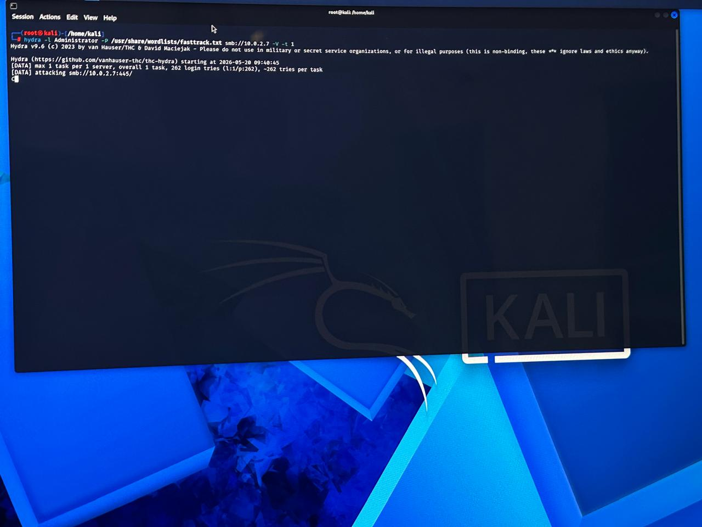
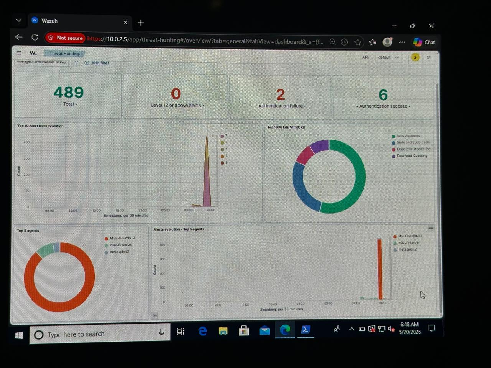
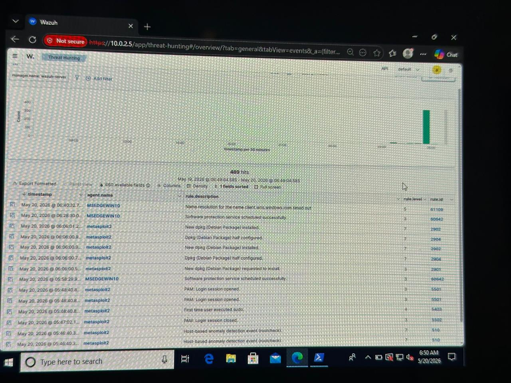
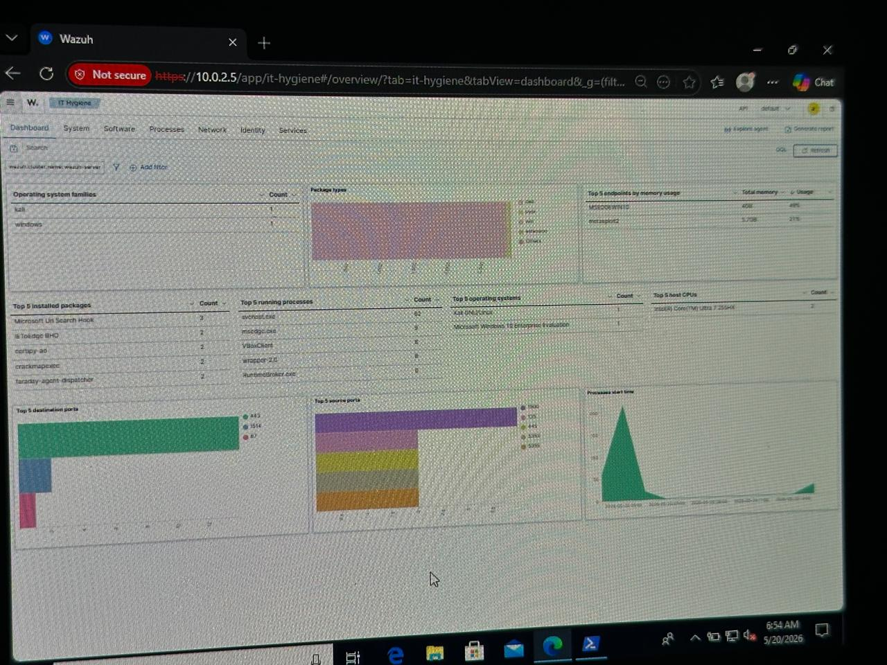

# 🛡️ Enterprise SIEM Deployment & Brute-Force Detection Lab (Wazuh & Kali Linux)

## 📌 Project Overview
This project demonstrates the deployment of an enterprise-grade **Wazuh SIEM (Security Information and Event Management)** solution to monitor, detect, and analyze real-time security events. The lab simulates a realistic cyber-attack scenario where a **Kali Linux** machine executes a **Brute-Force Attack (Password Guessing)** against a hardened **Windows 10 Enterprise** endpoint. The objective is to validate the capability of the SIEM platform to log, parse, and alert on malicious authentication behaviors mapped to global security frameworks.

---

## 🏗️ Lab Architecture & Topology
* **SIEM Server:** Wazuh Manager (Centralized Log Analytics & Alerts Dashboard)
* **Target Endpoint (Victim):** Windows 10 Enterprise (Monitored via Wazuh Agent)
* **Attacker Machine:** Kali Linux (Utilizing advanced password guessing tools)
* **Target Protocol:** SMB (Server Message Block) - Port 445

---

## ⚡ Active Defensive & Offensive Scenarios

### 1. Attack Simulation (Red Team)
To simulate a real-world credential stuffing attack, **Hydra** was deployed using a targeted wordlist to brute-force the Windows native `Administrator` account:
```bash
hydra -l Administrator -P /usr/share/wordlists/fasttrack.txt smb://10.0.2.7 -V -t 1


📊 Key Findings & SIEM Metrics
The Wazuh Manager successfully ingested and processed log data from the Windows host, yielding active defense results.
🛠️ Skills Demonstrated
 Deployment and Configuration of XDR/SIEM Agents.
 Log Ingestion, Event Parsing, and Alarm Generation.
 Operationalizing the MITRE ATT&CK framework for Threat Hunting.

### 1. Attack Simulation (Red Team)


### 2. SIEM Threat Hunting Dashboard


### 3. Security Event Log Breakdown


### 4. IT Hygiene & System Overview

 Controls (Active Firewall Drop vs. Log Generation).
 Forensic Analysis of Windows Authentication Failures.
